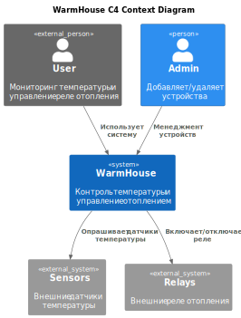
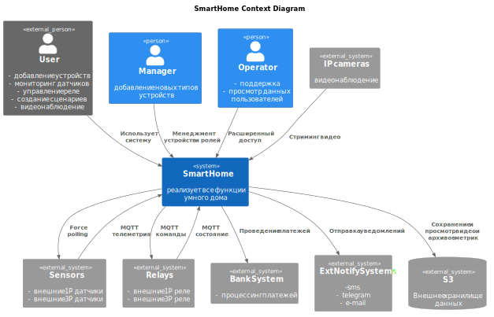
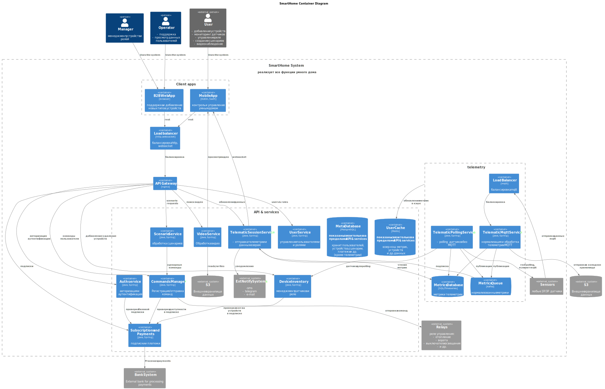
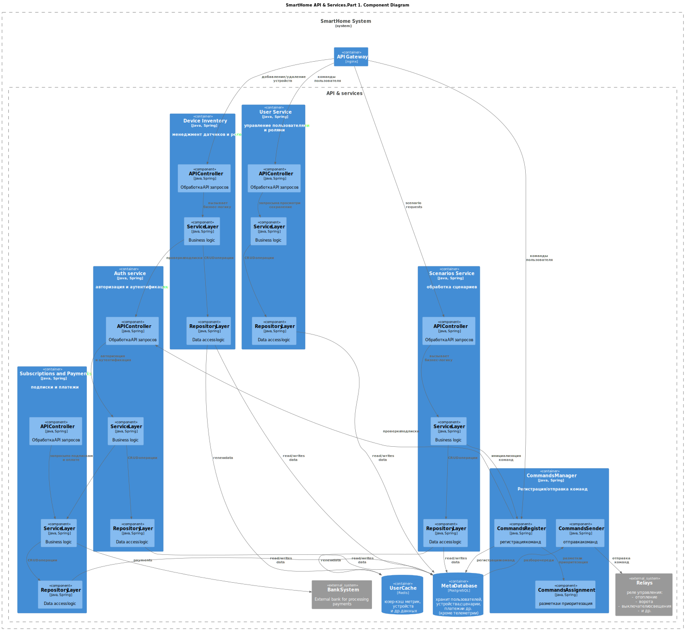
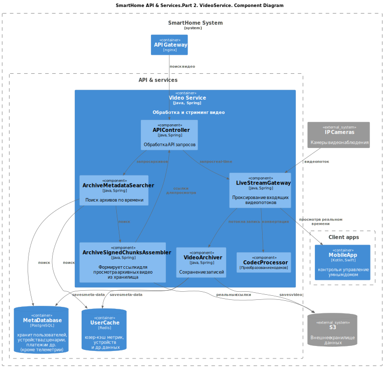
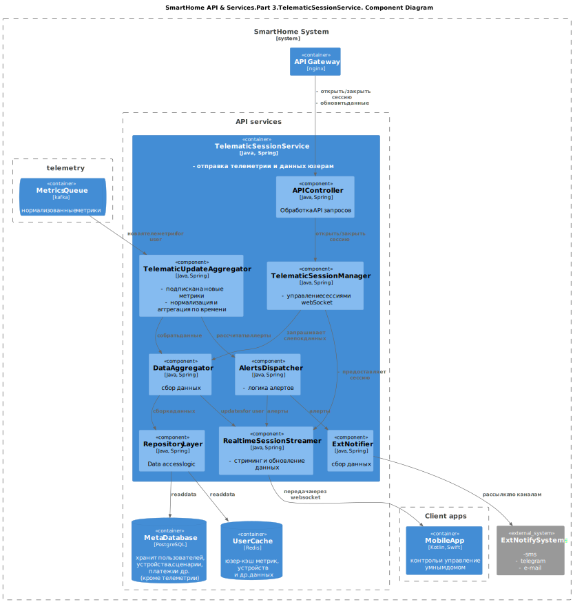
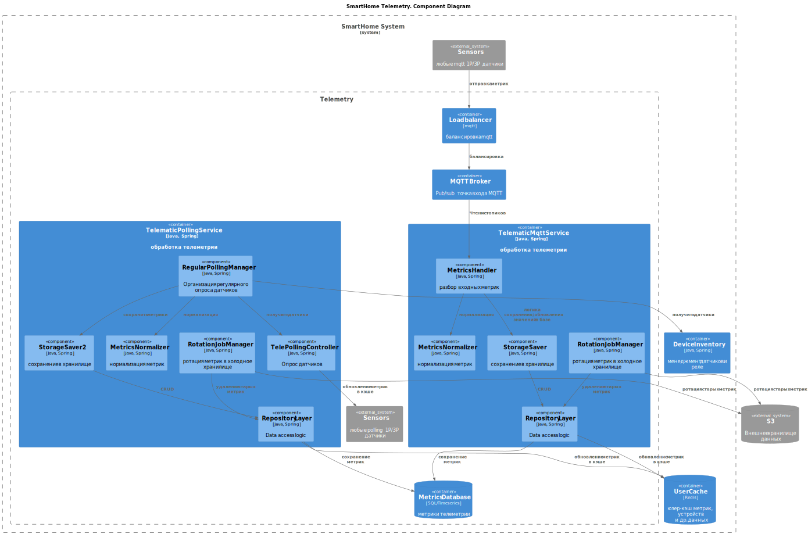
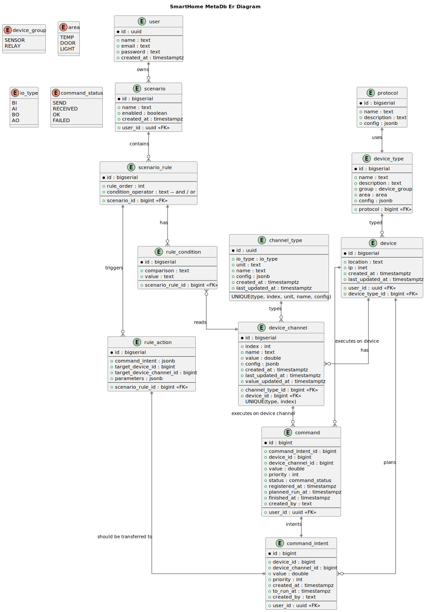

# Задание 1. Анализ (системы As-Is) и планирование
**Примечания**: 
- в этом задании описываются решения и проблемы, применительно к существующей (As-Is) системе.
- в п.1.5 диаграммы контекста C4 даны как As-Is, так и для To-Be систем.

### 1. Описание функциональности монолитного приложения (на основании задания в спринте и кода)
**Функциональные требования:**
- контроль температуры пользователями;
- включение/отключение реле отопления пользователями (предполагается из задания);
- добавление/удаление устройств специалистами при монтаже, а также, вероятно, настройка клиентского устройства;
- предположим, что функции оплаты нет, цена предоставления сервиса включена в стоимость продаваемых устройства;
### 2. Анализ архитектуры монолитного приложения
_Перечислите здесь основные особенности текущего приложения: какой язык программирования используется, какая база данных, как организовано взаимодействие между компонентами и так далее._

**Общее описание**
- монолит на Go;
- единая база данных Postgres и единый репозиторий;
- обновление показаний датчиков только через polling датчиков температуры (всех сразу или по одному) со стороны сервера после запроса клиента по внешнему API;
- включение/отключение реле отопления (предполагается из задания);
- единый API;
- только свои датчики и реле;
- низкая нагрузка сейчас: ограниченное число вэб-клиентов (100) и датчиков (100);

### 3. Определение доменов и границы контекстов
_Опишите здесь домены, которые вы выделили._

**DDD. Домены:**
- Контроль температуры и управление отоплением;

**DDD. Поддомены:**
В системе As-Is уже сейчас можно было бы выделить 3 поддомена.
- телеметрия температуры;
- управление реле отопления;
- менеджмент датчиков и реле (добавление, удаление);

**DDD. Контексты:**
- Контекст телеметрии температуры:
    - сущности: датчик температуры, sensorType;
    - объекты-значения: location, температура;
    - агрегаты: - ;
    - репозитории: через единый репо БД DB;
    - сервисы: TemperatureService:
      - опрос внешних датчиков температуры;
- Контекст управления отоплением:
    - сущности: реле отопления, команда управления;
    - объекты-значения: положение реле, статус команды управления;
    - агрегаты: - ;
    - репозитории: через единый репо БД DB;
    - сервисы: условный RelayService (предположительно сделан по аналогии с TemperatureService):
        - опрос/управление реле отопления;
- Контекст менеджмента устройствами датчиками и реле:
    - сущности: датчик температуры, реле отопления, relayType;
    - объекты-значения: location, положение реле, статус команды управления;
    - агрегаты: - ;
    - репозитории: через единый репо БД DB;
    - сервисы: SensorsHandler:
        - клиентский API для получения данных температуры;
        - (предполагается) клиентский API для управления реле отопления;
        - админский API для добавления/удаления устройств;

### **4. Проблемы монолитного решения**
- из-за смешения бизнес-логики уже имеющихся поддоменов/контекстов DDD в одном приложении будет сложней расширять код при добавлении новых функций; 
- возможные проблемы при росте кол-ва пользователей и устройств:
  - нельзя отдельно масштабировать единую базу данных для мета-информации и телеметрии;
  - рост потребления или времени ответа запросов обновления температуры, управления реле отопления;
  - появятся узкие места из-за различной нагрузки (например, сильно больше изменений показаний, чем команд управления или чтения);
- polling модель только при опросе со стороны клиента не позволит построить, например, суточные графики температуры и оптимизировать включение/отключение отопления;

### 5. Визуализация контекста системы — диаграмма С4
_Добавьте сюда диаграмму контекста в модели C4_

#### Система As-Is
#### C4 Диаграмма контекстов (Contexts)

#### Система To-Be
##### Функциональные требования:
- для пользователей:
  - контроль и управление отоплением;
  - включение/отключение света;
  - открытие/запирание дверей;
  - удаленное (видео)наблюдение;
  - сценарии умного дома;
  - самостоятельное добавление устройств и датчиков, в том числе сторонних;
- Saas система: т.е. подписки, платежи;
- возможность расширения функционала и расширение поддержки устройств;
#### C4 Диаграмма контекстов (Contexts) 

# Задание 2. Проектирование микросервисной архитектуры

#### Диаграмма контейнеров (Containers)

Добавьте диаграмму.

**Диаграмма компонентов (Components)**

**Диаграмма кода (Code)**

# Задание 3. Разработка ER-диаграммы

# Задание 4. Создание и документирование API
Описание основных эндпойнтов и подписок для некоторых микросервисов:
- Async API `telematic-mqtt-service` для взаимодействия с устройствами по MQTT : [acync-api.yaml](apps/telematic-mqtt-service/acync-api.yaml)
- Open API `device-inventory`  для менеджмента устройств [device-inventory_openapi.yaml](apps/device-inventory/device-inventory_openapi.yaml)
- Open API `command-manager` для управления [command-manager_openapi.yaml](apps/command-manager/command-manager_openapi.yaml)[device-inventory_openapi.yaml](apps/device-inventory/device-inventory_openapi.yaml)

# Задание 5. Работа с docker и docker-compose
Реализован микросервис  `temperature-api`, который имитирует отдачу показаний датчиками температуры при опросе из монолита. Выдает рандомные значения температуры.
Проверить можно, добавив несколько датчиков через `POST /api/v1/sensors`, а затем опросив через `GET /api/v1/sensors` несколько раз, убедившись, что значения температуры меняются.
- для проверки можно использовать обновленную коллекцию [smarthome-api.postman_collection.json](apps/smart_home/smarthome-api.postman_collection.json)

# **Задание 6. Разработка MVP**
**Что реализовано для демонстрации вариантов распила монолита:**
1. Ответственность по менеджменту устройств передана новому микросервису [device-inventory](apps/device-inventory), в котором реализован:
  - `POST /api/v1/devices` - добавляется устройство и дефолтный температурыный `device_channel`.
  - `GET /api/v1/devices` - возвращает устройство со списком всех device_channels.
  - `DELETE /api/v1/devices/{deviceId}` - удаляется устройство и все его `device_channels`.
  - liquibase скрипты по таблицам `sensor`, `device_channel` и `device` - также реализованы в этом сервисе.
  - для ручного создания устройств можно воспользоваться [device-inventory_api.postman_collection.json](apps/device-inventory/device-inventory_api.postman_collection.json)
2. Для возможности вырезать из монолита ответственность по организации опроса датчиков сделано:
- Добавлен контейнер с очередью `RabbitMQ` для имитации поставки данных от сенсоров по MQTT. 
- В [temperature-api](apps/temperature-api) добавлен шедулер `TemperatureScheduler.publishTemperatures` имитирующий поставку рандомных значений температуры в очередь раз в секунду.
- В [temperature-api](apps/temperature-api) добавлен шедулер `TemperatureScheduler.updateSensors` , который раз в 10 секунд обновляет актуальный список сенсоров из нового сервиса `device-invertory` - для передачи показаний температуры по актуальным устройствам.
- Добавлен новый сервис [telematic-mqtt-service](apps/telematic-mqtt-service), в котором реализован [MqttMetricsHandler](apps/telematic-mqtt-service/src/main/java/org/example/telematic_mqtt_service/mqtt/MqttMetricsHandler.java), разбирающий очередь и обновляющих значения в новой таблице `device_channel`, но с меньшей частотой, чем приходят показания в очередь.
3. Для отрыва ответственности "передачи данных телеметрии на клиентские устройства" в монолит добавлен endpoint `GET /api/v2/sensors` , который получает актуальные данные об устройствах и их показаниях температуры.
